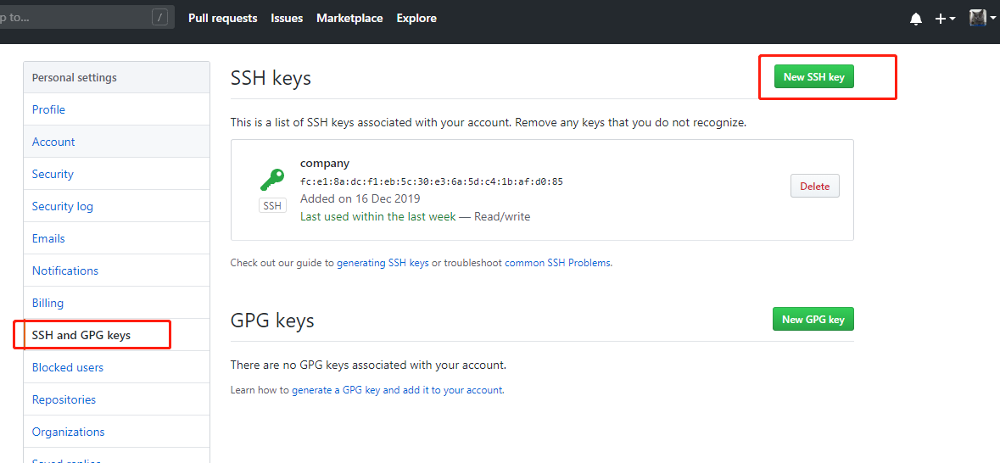
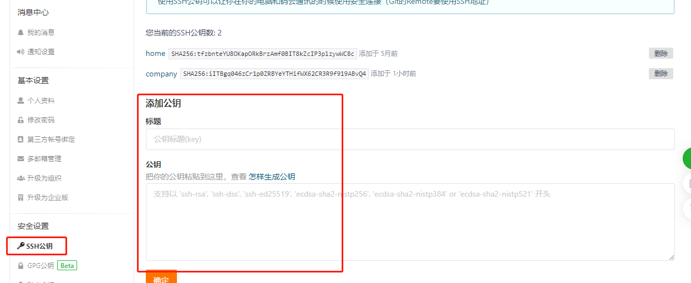

## 同一台电脑连接gitee及github，并设置不同账号

### 创建ssh key

	# 进入用户目录下的 .ssh 文件夹下
	# 没有这个文件夹也无所谓，直接运行下一句命令也可以
	cd ~/.ssh
	
	# 生成 key，将邮件地址替换为你 Gitee 或者 Github 使用的邮件地址
	ssh-keygen -t rsa -C "xxx@xxx.com"

会出现如下提示

	Generating public/private rsa key pair.
	Enter file in which to save the key (/c/Users/your_user_name/.ssh/id_rsa): 

这一步如果默认回车，就会生成名为`id_rsa`的文件，这里可以输入不同名字来识别文件，例如，Gitee的ssh key就是`id_rsa_gitee`，Github的ssh key就是`id_ras_github`。这里我输入`id_rsa_gitee`，然后回车

接下来就会看到：

	Enter passphrase (empty for no passphrase):

直接回车，然后会看到：

	Enter same passphrase again:

继续回车就行了。生成完毕：

	Your identification has been saved in id_rsa_gitee.
	Your public key has been saved in id_rsa_gitee.pub.
	The key fingerprint is:
	SHA256:F0K/ojCbFzgMPru11m4g/9uV03oHK+U0rKBLwOOye2c xxx@xxx.com
	The key's randomart image is:
	+---[RSA 2048]----+
	|        .        |
	|       . .       |
	|  .     . o      |
	| . + .   . o     |
	|  o X . S o.     |
	|  .+.O o.o o*    |
	|  oo=o+. .+=.+   |
	|   =++E. .oo+ .  |
	|  ++.*=o. .o .   |
	+----[SHA256]-----+

`id_rsa_github`文件也如以上步骤执行一遍即可。

### 在 Gitee 和 Github 添加 public key

找到用户目录下的 .ssh 文件夹，查看并复制创建好的`id_rsa_gitee.pub`或`id_rsa_github.pub` 的内容。

	cd ~/.ssh
	# 查看 id_rsa_gitee.pub 文件内容
	cat id_rsa_gitee.pub

会显示这样一串东西，复制它：

	ssh-rsa AAAAB3NzaC1yc2EAAAADAQABAAABAQDZbvgUEj3XAXH4HkW27ibdXgV6VHdrA9/WdSDHtiiC55mjPvxj3OtPxIbpeJmhWyHiJWR6
	uUuK+gkb//O51uWCPhHqxKR7+45tZ9jHqXW+hEKPp+odQgc+3hiHAjTkn3JGeIJlQp2UdJCDHBrp+kcgVeg91+y7cU3ufaUQ/hpD
	rCgn6uvwjwJgnDhV9DYi+gFUFe7LUwa1o4nfwg43ycuOOuT7c6VO2dj/0pLRUVTPQYu/C3kaaPVedir7mKIu/dM6Ec44bhYTp1Dq
	qp8BO42Cfo+n+dempqYTe2wcPvuDjSj884IATc/KvBfc86Yd2Uj7NI7li90Y3i6adoxUIWQh xxx@xxx.com

打开 Gitee 和 Github 的网站找到设置，再找到 SSH Keys，添加复制的 public key。

